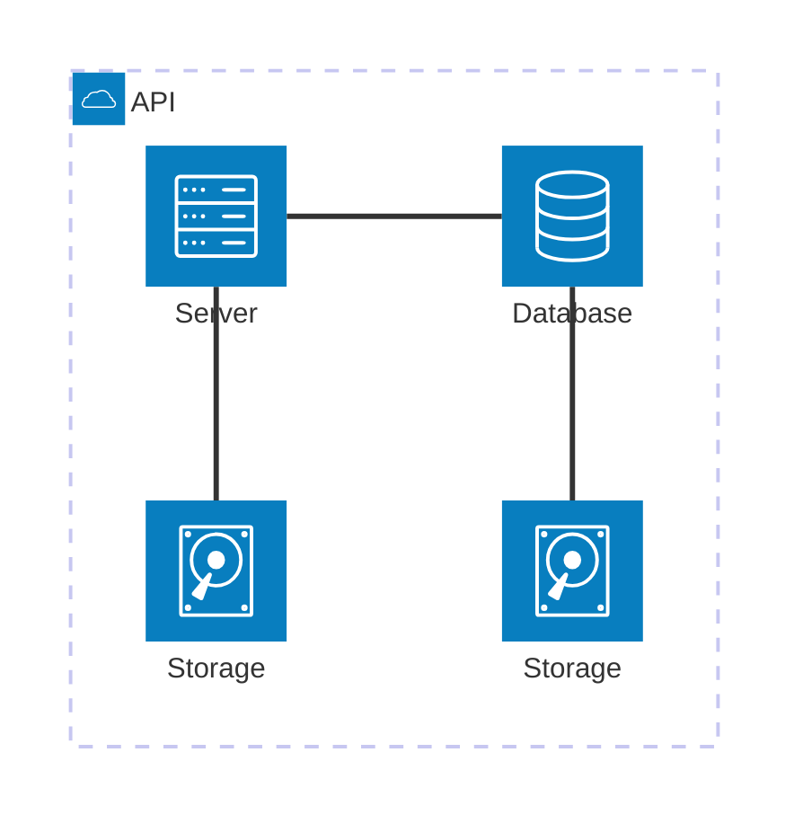
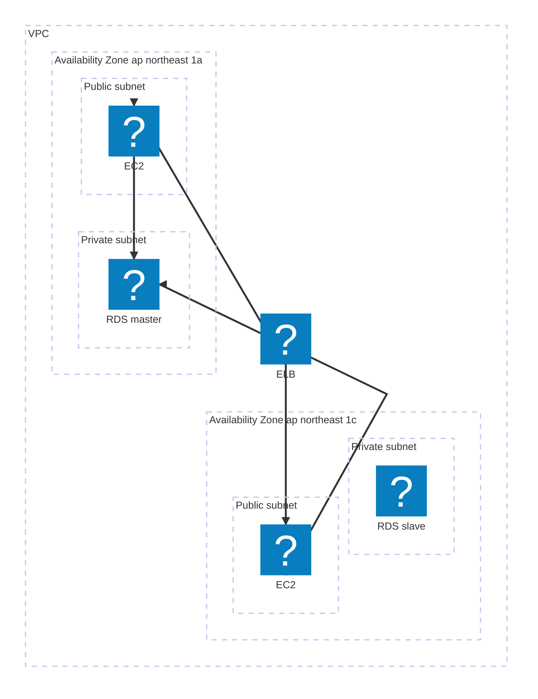
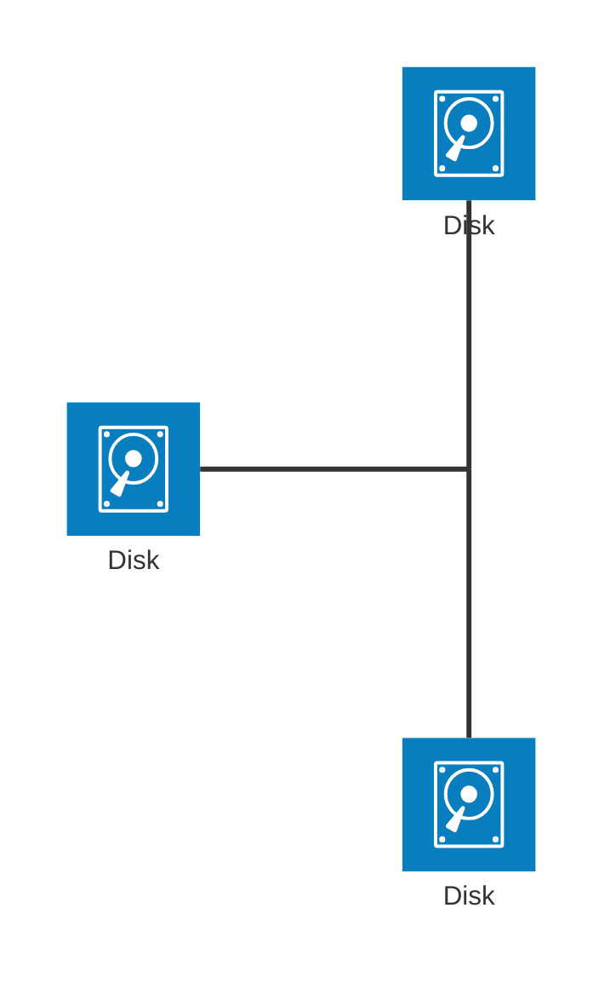

## Architecture Diagrams

```mermaid
architecture-beta
    group api(cloud)[API]

    service db(database)[Database] in api
    service disk1(disk)[Storage] in api
    service disk2(disk)[Storage] in api
    service server(server)[Server] in api

    db:L -- R:server
    disk1:T -- B:server
    disk2:T -- B:db

```

```mermaid
architecture-beta
    group vpc[VPC]

    service elb(logos:aws-elb)[ELB] in vpc

    group availabilityzone[Availability Zone ap northeast 1a] in vpc
    group availabilityzone2[Availability Zone ap northeast 1c] in vpc


    group publicsubnet[Public subnet] in availabilityzone
    group publicsubnet2[Public subnet] in availabilityzone2

    service ec2a(logos:aws-ec2)[EC2]in publicsubnet
    service ec2b(logos:aws-ec2)[EC2] in publicsubnet2

    group privatesubnet[Private subnet] in availabilityzone
    group privatesubnet2[Private subnet] in availabilityzone2 

    service rds(logos:aws-rds)[RDS master] in privatesubnet
    service rds2(logos:aws-rds)[RDS slave] in privatesubnet2


    elb:B --> T:ec2a
    elb:B --> T:ec2b
    ec2a:B --> T:rds
    ec2b:B --> R:rds

```

```mermaid
architecture-beta
    service left_disk(disk)[Disk]
    service top_disk(disk)[Disk]
    service bottom_disk(disk)[Disk]
    junction junctionCenter

    left_disk:R -- L:junctionCenter
    top_disk:B -- T:junctionCenter
    bottom_disk:T -- B:junctionCenter
```
